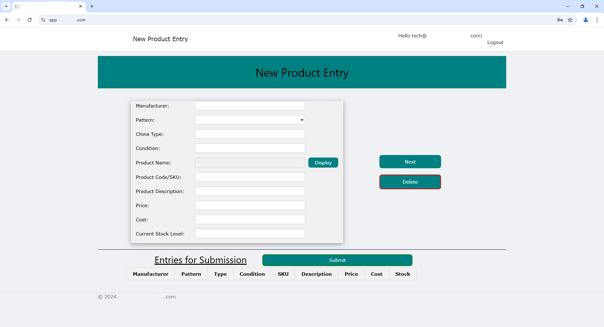

# CMS Product Entry UI

## Objective
To develop a user-friendly, web-based front-end interface that allows users to efficiently enter product data into a third-party CMS. The solution required seamless integration with a Node.js backend and communication with the CMS via RESTful APIs.

---

## Challenges
- Designing a dynamic UI to handle varied product categories and attributes.
- Ensuring smooth communication between the frontend and backend through RESTful APIs.
- Adhering to strict deadlines for delivering a production-ready system.

---

## Technologies Used
- **Frontend**: HTML, JavaScript, CSS
- **Backend**: Node.js
- **APIs**: RESTful APIs to integrate with the third-party CMS
- **Tools**: Visual Studio Code, Postman, Lucid for UI wireframes

---

## Solution

### **Architecture**
The application was built using a client-server architecture:
- **Frontend**: A responsive, JavaScript-powered interface that dynamically rendered forms based on the product type.
- **Backend**: A Node.js service handling:
  - Validation of product data.
  - Authentication and secure API calls to the CMS.
  - Logging and error tracking.

### **Frontend Features**
1. **Dynamic Form Rendering**: Built reusable JavaScript components to generate product entry forms dynamically based on CMS-provided schemas.
2. **Validation**: Implemented client-side validation for mandatory fields, formatting, and value ranges.
3. **User Experience**: Used CSS and tooltips for better usability.

### **Backend Features**
1. **Secure API Calls**: Established secure connections to the CMS using OAuth 2.0 authentication.
2. **Error Handling**: Designed detailed error logs to identify failed API calls or validation issues.
3. **Scalability**: Structured the codebase for easy addition of new product types.

---

## Outcomes
- Delivered a fully functional UI that reduced product entry time by 30%.
- Achieved zero downtime during deployment and testing.
- Improved user satisfaction through enhanced design and responsiveness.

---

## Visuals and Diagrams
### **Form Example**

### **System Flow Diagram**

---

## Key Takeaways
- Gained hands-on experience in integrating a frontend with third-party APIs.
- Improved JavaScript skills by developing dynamic UI components.
- Enhanced knowledge of API authentication and Node.js backend design.

---

## Lessons Learned
1. Dynamic forms benefit significantly from schema-driven design for flexibility.
2. Clear communication with third-party APIs minimizes integration errors.
3. Scalability must be a key consideration during the initial backend design phase.

