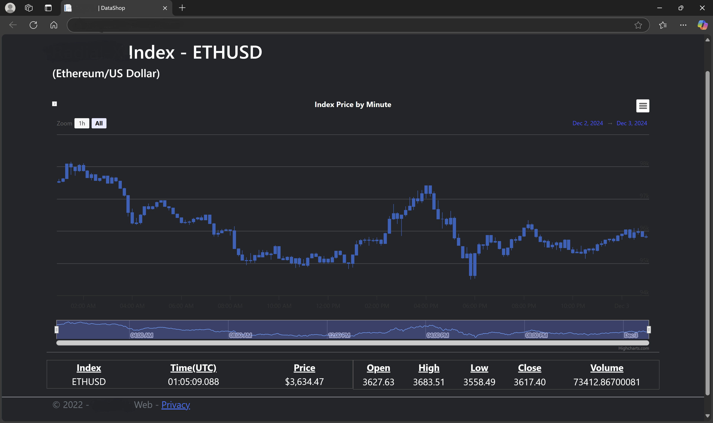

# Cryptocurrency Financial Index

## Objective
To build a high-performance cryptocurrency financial index capable of calculating updated prices multiple times per second. The system should provide real-time data to clients via a RESTful interface, WebSocket, and a web-based UI with price graphing capabilities.

## Challenges
- Processing data feeds from over a dozen exchanges.
- Ensuring scalability and performance while maintaining data consistency.
- Providing multiple client-facing interfaces (REST, WebSocket, UI).

## Technologies Used
- Programming Language: **C#**
- Frameworks: **.NET, ASP.NET Core**
- Infrastructure: **Azure Kubernetes Service (AKS)**
- APIs: **RESTful API, WebSocket**
- Frontend: **HTML, JavaScript, CSS**
- Database: Azure Database for MySQL flexible server

## Solution
- **Architecture**: Designed a distributed system using AKS to scale processing across nodes efficiently.
- **Real-Time Processing**: Implemented high-performance data-fetching mechanisms to pull data from multiple exchanges, ensuring updates every few milliseconds.
- **User Interfaces**: Built:
  - A REST API for programmatic access.
  - A WebSocket interface for real-time streaming.
  - A web-based UI for data visualization using JavaScript.

## Outcomes
- Delivered a system capable of processing thousands of updates per second with over 99.99% uptime.
- Enabled seamless client integration through well-documented APIs.
- Reduced operational costs by leveraging Azure Kubernetes.

---

## Visuals and Diagrams
### **UI Example**

### **System Flow Diagram**

---

## Key Takeaways
- Learned advanced Kubernetes orchestration to scale microservices.
- Enhanced expertise in real-time systems and RESTful API design.
- Improved client-side data visualization skills.
