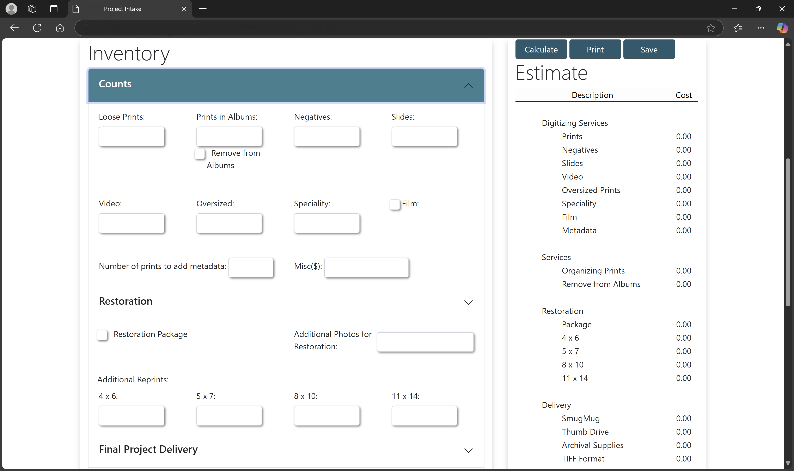

# Photo Archive Estimator

## Objective
To create a private, web-based tool for a local photo archiving company to calculate project estimates based on user inputs. The estimator needed to simplify the quote creation process by providing accurate cost calculations and printable estimates.

---

## Challenges
- Designing a clean and intuitive user interface to accommodate various project parameters.
- Developing a robust backend to handle complex cost calculations.
- Ensuring scalability for future enhancements (e.g., additional project types or pricing rules).

---

## Technologies Used
- **Frontend**: HTML, JavaScript, CSS
- **Backend**: Node.js
- **Tools**: Visual Studio Code, Git, Postman

---

## Solution

### **Architecture**
The system was developed using a modular architecture:
- **Frontend**: A responsive, lightweight interface for inputting project details and displaying results.
- **Backend**: A Node.js service for:
  - Validating user input.
  - Performing cost calculations based on configurable pricing rules.
  - Generating PDF estimates for printing.

### **Frontend Features**
1. **Input Forms**: Created dynamic forms for entering project parameters such as photo, negative and slide count, archive supplies, and delivery options.
2. **Real-Time Feedback**: Used JavaScript to provide immediate feedback on entered values (e.g., estimated cost ranges).
3. **Printable View**: Designed a printable estimate layout with branding for the photo archiving company.

### **Backend Features**
1. **Custom Pricing Engine**: Developed a pricing engine to compute costs based on:
   - Photo count.
   - Restoration.
   - Archival supplies.
   - Delivery methods (e.g., physical or digital).
2. **PDF Generation**: Integrated a library to convert estimates into professional-looking PDFs.

---

## Outcomes
- Delivered a fully operational estimator tool that reduced manual effort and human errors in quote preparation.
- Improved customer satisfaction by providing faster and more accurate estimates.
- Enabled scalability by designing the pricing engine to handle future business needs.

---

## Visuals and Diagrams
### **Estimator Interface**

### **Pricing Engine Flow**

---

## Key Takeaways
- Learned how to create dynamic, user-friendly interfaces with JavaScript.
- Gained experience in building a modular Node.js backend capable of handling complex calculations.
- Improved understanding of database design for configurable, user-driven applications.

---

## Lessons Learned
1. Modular pricing engines simplify future updates and maintenance.
2. Real-time feedback in the UI enhances user confidence and satisfaction.
3. Automating PDF generation provides a professional touch and eliminates manual formatting tasks.

